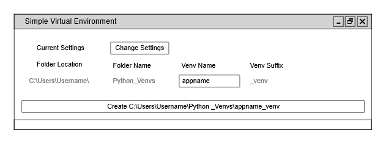
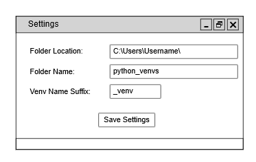

# Simple_Venv_Manager-python3.6-windows-
For now, it's mostly a simple script that will:

  * Create a folder if it doesn't exist.
  * Creates a venv with user supplied name.
  * Makes a .bat file on your desktop to use as a launcher that:
    * Launches a command prompt in the virtual environments folder, with the virtul environment activated.

What is the purpose of this tool?

  * To create and delete virtual environments using a GUI.
  * To create a launcher shortcut on your desktop that launches a command prompt in the virtual environment with the virtual environment activated.

How is this different from using another tool?

  * It's a small project that doesn't do much, makes it readable for the begginner.
  * But mostly, this is a project I started off with to help me complete a simple task I do repeatedly. I decided I want to turn this into a project for me to get more practice and learn from.

My hope is to remove a barrier for people just getting into Python. To have a way of managing virtual environments with no learning curve so they can focus on their study.

Usage:

  * Grab the file create_projects.py, place it on your desktop or anywhere you prefer. You can create a shortcut to it if you placed it in somewhere other than your desktop. The other files are not needed at this point in time.
  * Double click the to execute the python script.
  * A folder (called "python_venvs") will be created in the current users directory (Usually located at "C:\Users\\[Your username]\").
  * A name you specify will be used to create the environment (_venv will be appended to the environments name).
  * A .bat file will be created on your desktop with the name you provided (_venv will be appended to the name you provide).
  * Double click the .bat file to open a command prompt in the venv created, with the venv activated.

Roadmap:
  * GUI
  * User Settings
  * Reset to default
  * Delete
  * Recall each installation even if user setting changes

Mockups

